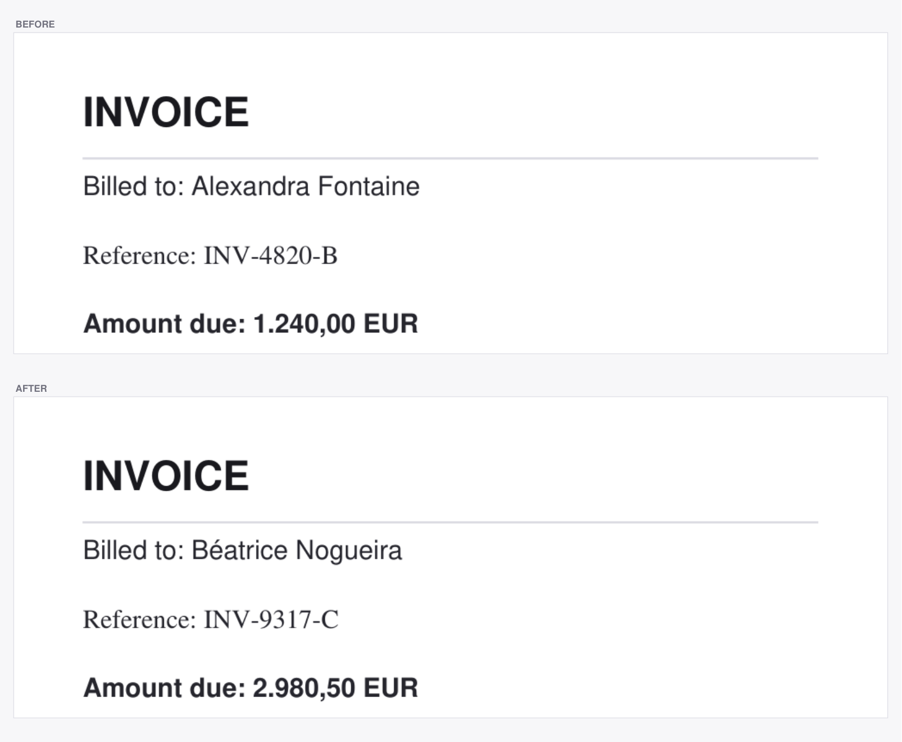
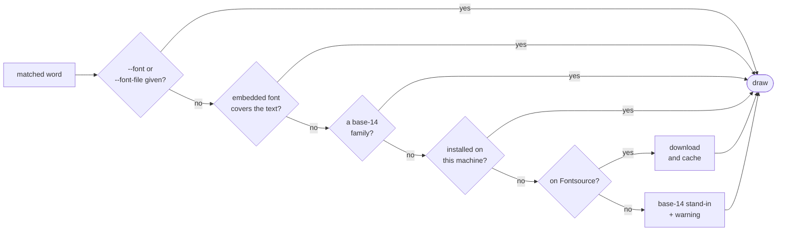

# pdf-retype

[](https://github.com/mariocosttaa/pdf-retype/actions/workflows/ci.yml)
[](https://www.python.org/downloads/)
[](https://pymupdf.readthedocs.io/)
[](LICENSE)
[](#install)

**Replace a word in a PDF and keep the typography.** `pdf-retype` finds the text,
reads the font it is actually set in, and rewrites it in the same typeface, size,
colour and baseline — telling you exactly how close the result is.

## Preview



*Three replacements, three different faces preserved — including the accent in
"Béatrice". Reproduce it with `python examples/make_preview.py`.*

## Why this is not a one-liner

Swapping text in a PDF is easy to do badly. Three things routinely go wrong, and
this tool exists to get them right.

**The embedded font usually cannot write your new text.** PDFs embed *subsets* —
only the glyphs that page happened to use. A real airline booking embeds Inter
SemiBold with exactly 17 glyphs in it; write `Mariana` with that and you get
holes. So the font is chosen by checking glyph coverage first, and falling back
in order of fidelity:



Every fallback is reported, so you always know whether the result is exact or an
approximation.

**Search rectangles bleed into neighbouring lines.** A match's box spans the full
line height and often overlaps the line above or below by a fraction of a point.
Redaction deletes every glyph it touches, so the naive approach quietly erases
unrelated text — in one real ticket, the ticket number sitting 0.1pt away. The
cleared area is trimmed against its neighbours before anything is removed.

**The PDF's own font metadata lies.** The font descriptor carries a serif flag,
and producers set it wrongly often enough to be useless — one airline PDF marks
GT Flexa, a grotesque sans, as serif. Trusting it turns a sans-serif document
into Times. `pdf-retype` reads the `OS/2` table of the font program instead.

## Install

```bash
pip install pdf-retype
```

From source:

```bash
git clone https://github.com/mariocosttaa/pdf-retype
cd pdf-retype
pip install -e ".[dev]"
```

Requires Python 3.10+. The only runtime dependency is
[PyMuPDF](https://pymupdf.readthedocs.io/).

## Quick start

Run it with no arguments and it walks you through everything:

```bash
pdf-retype
```

```
Choose a PDF — ~/Downloads
─────────────────────────────────────────────
 ../
 invoices/
 booking.pdf  (79.2 KB)
 ticket.pdf   (103.9 KB)

↑↓ move   ⏎ open/select   ← up   ~ home   q cancel
```

It then asks for the word, shows every match with the font it is set in, lets you
untick the ones to leave alone, and writes only after you confirm — then offers to
change something else in the same file. See [Guided mode](#guided-mode).

Or drive it one command at a time:

```console
$ pdf-retype find booking.pdf "Alfredo"
1 match in booking.pdf

  p.1  'Alfredo'
       GTFlexa-Bold 12.0pt bold  #000000  at (63, 828)

$ pdf-retype replace booking.pdf "Referência" "Referência MB" --pages 1
replaced 1 occurrence(s) of 'Referência' with 'Referência MB'

  p.1  'Referência:' -> 'Referência MB'
       drawn with Inter 700 9.5pt (was 12.0pt) — downloaded Inter 700 normal [latin]
       ! the embedded Inter-Bold is a subset without 'B' — looking for the full family
       ! shrunk from 12.0pt to 9.5pt to fit

Saved to booking.replaced.pdf
```

Those warnings are the point: the embedded font could not write a `B`, a real
Inter Bold was fetched instead, and the text had to shrink to clear the next word.

## Commands

| Command | What it does |
| --- | --- |
| `pdf-retype` | Guided mode, starting in the current folder |
| `pdf-retype start [DIR]` | Guided mode, starting somewhere else |
| `pdf-retype fonts FILE` | List the fonts the document uses |
| `pdf-retype fonts FILE --plan TEXT` | Show which font each one would be rewritten with |
| `pdf-retype find FILE WORD` | Locate a word and report its font, size and colour |
| `pdf-retype replace FILE OLD NEW` | Replace it, keeping the look |
| `pdf-retype cache` | Show or clear the downloaded font cache |

### `fonts` — what is this document set in?

```console
$ pdf-retype fonts booking.pdf --plan "Mariana Sá"
  GTFlexa-Regular
    -> replacement text would use: base-14 stand-in
       ! the embedded GTFlexa-Regular is a subset without 'MinSá' — looking for the full family
       ! 'GT Flexa' not found on Fontsource (or no network)
       ! drawing with helv instead of GTFlexa-Regular — the shape will differ from the original

  Inter-Bold
    -> replacement text would use: downloaded Inter 700 normal [latin]
       ! the embedded Inter-Bold is a subset without 'Sá' — looking for the full family
```

`--plan` answers "will this work?" before you change anything.

### `find` — where is the word, and how does it look?

```console
$ pdf-retype find booking.pdf "Alfred Kosta" --fuzzy --threshold 0.7
1 similar match in booking.pdf

  p.1  'Alfredo Costa'  score 0.88
       GTFlexa-Bold 12.0pt bold  #000000  at (63, 828)
```

`--fuzzy` matches by similarity, so typos, different casing and missing accents
still land. Accents are ignored when comparing unless you pass `--strict-accents`.

### `replace` — swap it, keeping the look

```bash
# writes booking.replaced.pdf, never touching the original
pdf-retype replace booking.pdf "Alfredo Costa" "Mariana Pereira"

# see what would happen, change nothing
pdf-retype replace booking.pdf "Alfredo" "Mariana" --dry-run

# near-matches, first two hits only, into a named file
pdf-retype replace booking.pdf "Alfred Kosta" "Mariana" --fuzzy --limit 2 -o out.pdf

# delete a word instead of replacing it
pdf-retype replace booking.pdf "CONFIDENTIAL" ""
```

Nothing is overwritten by accident: output defaults to `<name>.replaced.pdf`, an
existing target needs `--force`, and the source is only touched with `--in-place`.
Even then the file is rewritten from scratch rather than saved incrementally, so
the replaced text does not survive as a recoverable earlier revision.

## Guided mode

Six steps, each of which you can back out of:

1. **Pick the file.** Arrow keys through folders and PDFs; `←` goes up, `~` jumps
   home, `q` cancels. Only PDFs are listed, with their sizes.
2. **Type the word.** If there is no exact match it offers a similarity search
   instead of just failing, and lets you try another word.
3. **Review the matches**, each with its page, the text as printed, and its font.
4. **Choose which ones.** With several matches you get a checklist — `space`
   toggles, `a` selects all, `n` none. A single match skips this step.
5. **Type the replacement**, then read the plan: the font that will really be
   used, the size, and any warnings.
6. **Confirm.** Nothing is written before you say yes and choose where to save.

It then asks whether to change something else in the same file and loops back to
step 2, so a batch of edits happens in one sitting. Each round is saved as it is
applied, the destination is asked only once, and a summary closes the session:

```
3 change(s), 3 replacement(s) in total:
  1. 'XRBYVW' -> 'AAA111'  (1×)
  2. 'Alfredo Costa' -> 'Mariana Pereira'  (1×)
  3. '861,00' -> '999,00'  (1×)
```

The list screens need a terminal; piped into a script they degrade to numbered
prompts, so the mode still works in a pipeline.

## Options worth knowing

| Option | What it does |
| --- | --- |
| `--fuzzy`, `--threshold R` | match similar words, at similarity `R` (default `0.82`) |
| `--pages 1,3,5-7` | restrict to certain pages |
| `--fit auto\|shrink\|overflow` | when the new text is wider: use free space on the line (default), stay inside the old box, or keep the size regardless |
| `--min-ratio R` | how far shrinking may go, as a fraction of the original size |
| `--align left\|center\|right` | where to place the new text in the old box |
| `--font BASE14`, `--font-file PATH` | force a typeface (`helv`, `tiro`, `cour`, … or a `.ttf`/`.otf`) |
| `--size`, `--color`, `--fill` | force size, text colour, or paint the cleared box |
| `--limit N`, `--dry-run` | cap the number of replacements, or make none at all |
| `--offline` | never download a font |
| `--no-embedded` | ignore the PDF's own font programs |
| `--json` | machine-readable output, for every command |

Downloaded fonts are cached under `~/.cache/pdf-retype/fonts`; inspect or empty it
with `pdf-retype cache` and `pdf-retype cache --clear`.

## Project structure

| Path | What lives there |
| --- | --- |
| `pdf_retype/search.py` | finding text, exact and by similarity |
| `pdf_retype/fonts.py` | describing spans, choosing a font to draw with |
| `pdf_retype/fontlib.py` | font names, system font index, Fontsource downloads |
| `pdf_retype/replace.py` | redaction, fitting, drawing the new text |
| `pdf_retype/cli.py` | argument parsing and reporting |
| `pdf_retype/interactive.py` | the guided mode |
| `examples/` | sample and preview generators |
| `tests/` | the test suite |

## What it will not do

Being clear about the limits, because they are structural rather than bugs:

- **Reflow.** Replacement text is drawn where the old text was. It can use free
  space on the line and it can shrink, but it will not re-wrap a paragraph.
- **Rotated or transformed text.** Only horizontal text is placed correctly.
- **Scanned PDFs.** If the page is an image, there is no text to find. Run OCR first.
- **Commercial fonts you do not have.** GT Flexa is not on Fontsource and cannot be
  downloaded. You get a warned base-14 stand-in, or you supply `--font-file`.
- **Perfect invisibility.** A rewritten line is exact when the original font is
  reusable, and merely close when it is not. The report always says which.

Also worth saying plainly: this edits documents, which means it can be used to
falsify them. Use it on documents you have the right to change.

## Development

```bash
pip install -e ".[dev]"
pytest                                       # 55 tests
python examples/make_sample.py sample.pdf    # a PDF to experiment on
```

Contributions are welcome — see [CONTRIBUTING.md](CONTRIBUTING.md).

## License

MIT — see [LICENSE](LICENSE).
